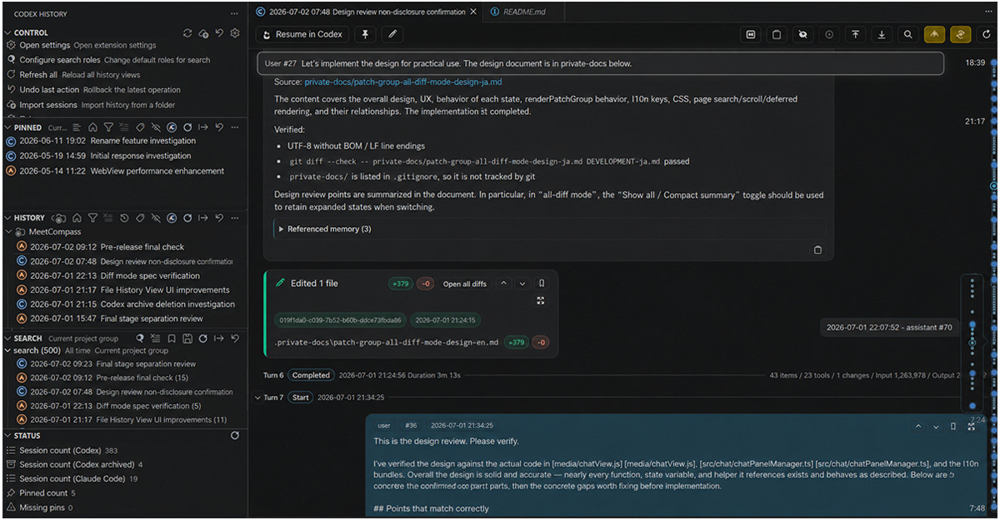

# Codex History Viewer

Browse, search, organize, and resume past Codex CLI / Claude Code sessions through the official VS Code extensions.

Latest release: **2.4.0** (2026-05-23).

## Why Use This Extension?

Codex and Claude Code sessions can become hard to revisit once they are no longer active in the editor. Codex History Viewer keeps those local session files useful by turning them into a searchable, chat-like history browser inside VS Code.

Use it to find past prompts, reuse useful answers, inspect file changes, organize sessions with tags and notes, resume same-source sessions, and prepare handoff context for other AI tools.

## Highlights

- **Revisit past Codex CLI and Claude Code sessions** that are no longer easy to access from the active editor flow.
- Browse sessions in a year / month / day tree, a latest-first list, or project-grouped views.
- Optionally include Codex `archived_sessions` when the Codex source is enabled, and switch archive visibility instantly.
- Show valid cached History and Pinned data immediately at startup while local session files refresh in the background.
- Search across prompts, responses, tool output, tags, notes, and attachment metadata.
- View sessions in a chat-like UI with Markdown, code highlighting, math rendering, tool cards, and file-change diffs.
- Open **AI Change History** for a workspace file to review Codex / Claude diffs that touched that file.
- Bookmark important history cards and use date-guide markers to revisit them quickly.
- Keep open chat tabs up to date with header-controlled auto-refresh modes.
- Show supported image attachments, Claude documents, and file references from Codex / Claude sessions as compact cards.
- Organize sessions with pins, tags, notes, custom titles, saved searches, project modes, and filters.
- Keep Pinned filters independent from History/Search, including project, source, archive visibility, tags, and sort mode.
- Resume past sessions through the official Codex and Claude Code VS Code extensions.
- Create handoff files and prompts when moving work to another AI tool.

## Quick Start

1. Open the Activity Bar and select **Codex History**.
2. Use **Control** for global actions such as settings, import, rebuild cache, empty trash, and search defaults.
3. Browse sessions under **History** and switch between date, latest, and project-grouped views.
4. Select a session to open the reusable chat tab, or run **Open in New Tab (Chat)** to keep it in its own tab.
5. Use **Pinned** for saved sessions with its own date, project, source, archive, tag, and sort controls.
6. Run **Search...** and refine with roles, query syntax, presets, and search tag filters.
7. Use context menus or chat header actions to edit tags/notes and run bulk tag operations when needed.
8. Enable **File Change History > Explorer Context Menu: Enabled** when you want file-level AI diff history from file right-click menus.
9. Keep Codex enabled in **Sources: Enabled**, then turn on Codex archived sessions if you want archived Codex history included.
10. Resume a same-source session through the official Codex or Claude Code extension, or use **Handoff to Other AI** when moving work between agents.

## History and Pinned Organization

History supports three project modes: **No Project Filter**, **Current Project**, and **Group by Project**. Project matching is case-insensitive across platforms. Grouped project views preserve the existing layout choice: latest-first history becomes `Project -> Session`, while date-grouped history becomes `Project -> Year -> Month -> Day -> Session`.

Pinned has its own project, source, archive visibility, date, and tag filters. It does not follow History/Search filter state, so saved sessions can stay focused on a different project or source while you browse and search elsewhere. Pinned can also switch between pinned-date order and session-date order.

## Chat Viewer

The chat viewer renders local session files as readable conversation timelines. It supports Markdown, syntax-highlighted fenced code blocks, KaTeX-compatible math, assistant usage metadata, environment snapshots, tool execution metadata, and grouped file-change cards from patch activity.

Large histories can use the `auto`, `normal`, or `simplified` performance mode. Heavy tool details and large diff rows can be deferred until **Show details** is enabled or an individual entry is expanded.

Chat tabs preserve useful state across reload and auto-refresh, including scroll position, selected message, expanded cards/diffs, detail visibility, diff wrapping, and in-page search state.

## Attachments and References

The chat viewer keeps attachments and file references out of the message body and renders them as cards instead.

- Supported images from Codex / Claude sessions are loaded on demand and can be previewed or saved.
- Claude Code PDF, text, and generic documents render as document cards. Text document previews open inside the card, and embedded payloads are saved on demand.
- Claude Code IDE opened-file and selection markers render as file/selection reference cards instead of raw inline tags.
- Codex mentioned-file blocks render as file reference cards while the actual request body remains as message text, including blocks that appear after IDE context.
- File reference cards can open local files through VS Code. Referenced files are not read automatically for rendering, search, resume, or handoff.
- Card metadata such as path, MIME type, and size is available from tooltips instead of taking over the conversation layout.
- Markdown transcripts, resume text, and handoff files use clean text plus attachment summaries instead of repeating raw tags or file blocks.

## Search

Search is local, cancellable, and backed by an incremental search index. It can search conversation text, configured tool metadata, titles, tags, notes, and attachment metadata.

Supported query forms include normal substring search, `exact:...`, `re:...`, `/regex/`, and boolean `AND` / `OR` / `NOT`.

Search follows the History date, project, source, and archive-visibility filters. It does not follow Pinned filters.

The search index can be tuned with `codexHistoryViewer.search.indexToolContent`:

- `conversationOnly`
- `toolCalls`
- `toolCallsAndOutputs`

Attachment indexing includes labels, paths, MIME types, file kinds, and bounded text from Claude text documents. PDF / Office / binary / base64 document contents and Codex referenced-file contents are not indexed.

## Codex Archived Sessions

Codex History Viewer can optionally read Codex `archived_sessions` in addition to normal Codex `sessions`. Archived sessions can be shown as active only, archived only, or all. History/Search and Pinned keep separate archive-visibility state. Active Codex sessions expose **Move to Archive**, while archived Codex sessions expose **Move to Codex History**.

Archive and restore operations prefer the official Codex provider. Moving archived sessions back to normal Codex history can fall back to a filesystem move when the official provider is unavailable. Pins, annotations, bookmarks, and saved chat positions are relocated when the session path changes.

## Handoff to Other AI

Handoff actions appear under **Handoff to Other AI** for visible Codex / Claude sessions when `codexHistoryViewer.handoff.enabled` is enabled. They can create a reusable handoff file, copy a prompt that points another AI to that file, or open the handoff file for manual use. Codex sessions can also be handed off directly to Claude Code when the Claude Code extension is available.

Handoff files are stored in this extension's VS Code global storage and include a tail-prioritized transcript excerpt, the latest user request, the source session path, recoverable file changes, and attachment summaries. Tool calls, tool outputs, and binary attachment payloads are intentionally omitted.

## AI Change History

AI Change History starts from a workspace file and shows the Codex / Claude changes that touched that file over time.

Use it when you want to answer questions such as:

- Which AI session changed this file?
- How did this file evolve across Codex and Claude sessions?
- What was the surrounding session context for a specific diff?

The Explorer file context menu entry is opt-in. Enable **File Change History > Explorer Context Menu: Enabled**, then right-click a file in VS Code Explorer and run **Show File AI Change History**.

The view is scoped to the current workspace and selected file. It supports Codex / Claude source toggles, in-view search, incremental **Load more**, previous/next navigation, and **Open in History** links back to the matching diff card in the original session.

## Configuration

Most settings are available from VS Code Settings under **Codex History Viewer**. Common settings include:

- `codexHistoryViewer.sources.enabled`: enable `codex`, `claude`, or both.
- `codexHistoryViewer.sessionsRoot`: Codex sessions root.
- `codexHistoryViewer.claude.sessionsRoot`: Claude Code sessions root.
- `codexHistoryViewer.codex.archivedSessions.enabled`: include Codex archived sessions.
- `codexHistoryViewer.handoff.enabled`: show cross-agent handoff actions.
- `codexHistoryViewer.search.indexToolContent`: control search index tool-content scope.
- `codexHistoryViewer.fileChangeHistory.explorerContextMenu.enabled`: show **File AI Change History** in Explorer.
- `codexHistoryViewer.autoRefresh.enabled`: refresh History and opt-in chat tabs when local session files change.
- `codexHistoryViewer.chat.openPosition`: open chat at top, last viewed message, or latest rendered card.
- `codexHistoryViewer.chat.performanceMode`: choose default chat rendering performance mode.
- `codexHistoryViewer.images.enabled`: show supported image attachments.
- `codexHistoryViewer.ui.timeGuide.enabled`: enable compact date guides and bookmark controls.
- `codexHistoryViewer.ui.language`: choose `auto`, `en`, or `ja`.

If history or search results look stale, run **Control > Rebuild Cache**. It recreates both the history cache and search index after confirmation.

## Commands

Most actions are available from view title buttons and tree context menus.

For the full command list with per-command descriptions, see:

- [Command Reference](docs/commands.md)

## OpenAI Codex Integration Notes

- The first **Resume in OpenAI Codex** may show a VS Code security prompt for the target extension URI. Click **Open** to continue.
- If the official Codex extension stops reopening a conversation, try `Developer: Reload Webviews`, then `Developer: Restart Extension Host`, then `Developer: Reload Window`.
- **Move to Archive** and **Move to Codex History** use the official Codex provider when available. Moving archived sessions back to normal history can fall back to a filesystem move if needed.

## What's New in 2.4.0

- Added History project modes for no project filter, current project, and grouped-by-project views.
- Added independent Pinned project, source, archive, date, tag, and sort controls.
- Added Pinned sorting by pinned date or original session date.
- Changed project matching to be case-insensitive across platforms.
- Changed Search toolbar ordering so **Clear Results** appears before **Rerun Search**.
- Fixed Codex mentioned-file blocks after IDE context so HTML, log, JSON, and other references render as file-reference attachments.

## Changelog

See [CHANGELOG](CHANGELOG.md).

## Security

See [SECURITY](SECURITY.md). Use the latest release whenever possible; do not install or redistribute v1.2.1 or earlier VSIX files.

## Privacy

This extension reads local session files and renders them inside VS Code. It does not implement any network communication and does not send session content anywhere.

If you use **Copy Quick Prompt** or **Copy Handoff Prompt to Clipboard**, this extension copies session context to your clipboard. Data is only sent externally if you paste it into another tool or extension.

When you open a session as a Markdown transcript, the generated transcript includes local paths such as the session file path and CWD. Review before sharing.

## Disclaimer

Codex History Viewer is an independent project and is not affiliated with, endorsed by, or officially associated with OpenAI, Anthropic, Codex, or Claude.

This extension works with locally stored session and history files created by official tools and extensions. Their file formats and internal behaviors may change without notice, which may affect compatibility.

Archive, restore, delete, import, and other file operations are designed to be conservative, but they may move or modify local files and extension-managed metadata. The author and contributors cannot guarantee recovery of lost or corrupted data.

Please keep backups of important session data.

